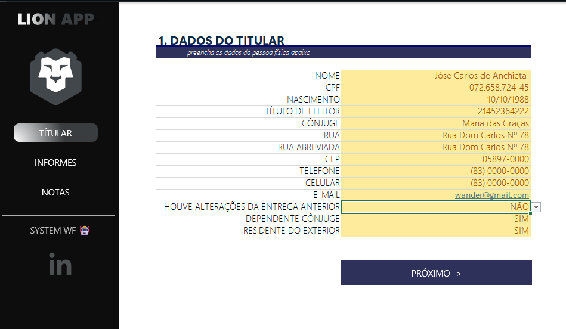
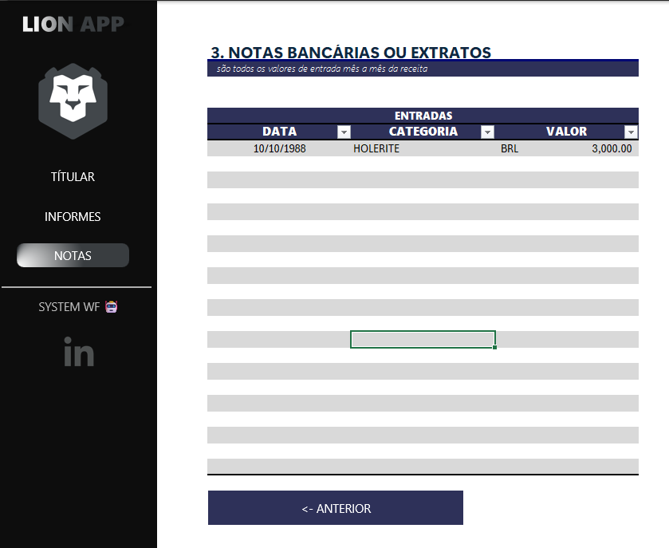
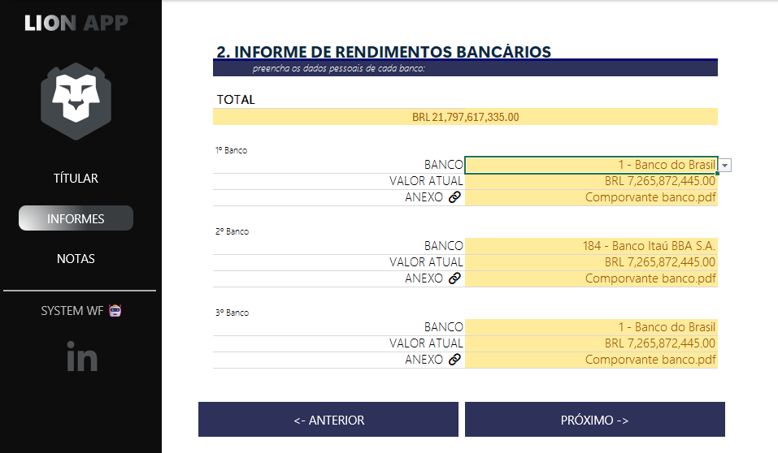

# DIO – Organizador de Declaração de Imposto de Renda

## Introdução  
A presente atividade tem como objetivo desenvolver uma planilha inteligente no Excel para auxiliar no **controle e cálculo do Imposto de Renda**, permitindo ao usuário organizar rendimentos, deduções e simular cenários de tributação de forma prática e visual.

## Pré-requisitos  
- Conhecimentos básicos de Excel (fórmulas, formatação, tabelas).  
- Noções de tributação e regras do Imposto de Renda.  
- Organização de dados financeiros em planilhas.  

## Base da Tabela  
Criação de uma tabela estruturada com informações essenciais:  
- Titular: tabela que reunirá os dados do usuário.  
- Informes: tabela responsável por gerenciar os dados bancários do cliente.  
- Notas: tabela responsável por gerenciar as entradas do usuário.  
 
## Conclusão  
A atividade proporciona ao aluno a prática de **modelagem tributária no Excel**, unindo conceitos de legislação fiscal com técnicas avançadas de planilhas. O resultado é uma ferramenta funcional para planejamento financeiro e tomada de decisão.

 

    

 

    

